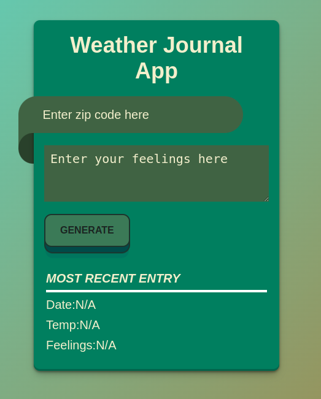
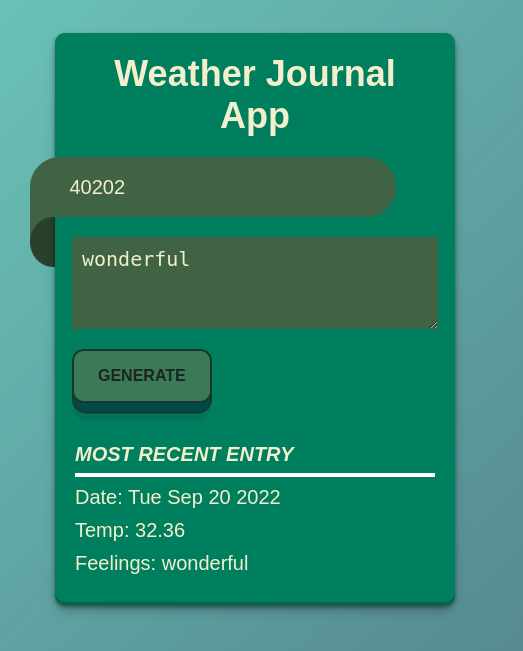

# Weather Journal App with Asynchronous JavaScript

## This project is an asynchronous web app that uses Web API and user data to dynamically update the UI in a Weather Journal application.

## How To Run The Project
- Download the code to your local computer
- Type `npm i` to install the dependencies
- Run `node server.js` to start the server

## Overview
> Youtube Link: https://www.youtube.com/watch?v=AGTmt3kyM-0

